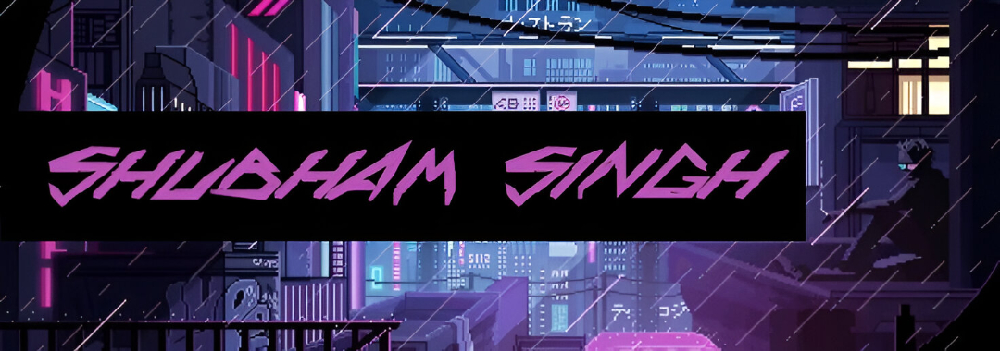
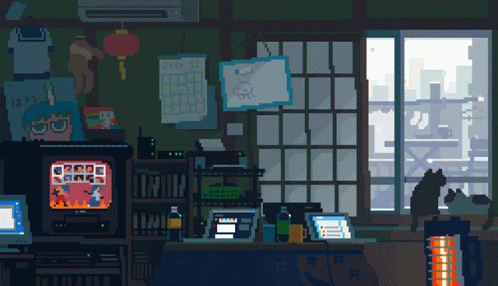

 

  &nbsp;
  &nbsp;
  &nbsp;
  

 

 

##  About Me

### Hey there, I’m Shubham Singh 👋  

- 🦄 Crafting something cool like [**Cloud_Deck**](https://github.com/Shubham-Singh-01/Cloud_Deck)
 
- 📖 Currently binge-learning **Everything** (yes, even regex 🌀)  
- 🧠 Talk to me about **React, Node.js, Java, Python** — or how to fix your build at 3am  
- 📬 Say hello: **singh200410@gmail.com**  
- ⚡ Superpower: Turning coffee into code (and bugs into features) ☕  

 

  
  &nbsp;
  

##  Tech Stack

  

    
<b>Frontend & Design</b>

     
    
  

  

    
<b>Backend & Database</b>

     
    
  

  

    
<b>DevOps & Tools</b>

     
    
  

 

  
  

##  Featured Projects

  

    
    
  

##  GitHub Stats
<picture>
  <source media="(prefers-color-scheme: dark)" srcset="https://raw.githubusercontent.com/Shubham-Singh-01/Shubham-Singh-01/gh-3d/profile-3d-contrib/profile-night-rainbow.svg" />
  <source media="(prefers-color-scheme: light)" srcset="https://raw.githubusercontent.com/Shubham-Singh-01/Shubham-Singh-01/gh-3d/profile-3d-contrib/profile-south-season-animate.svg" />
  
</picture>

##  GitHub Trophies

  

<h1></h1>

  

<h2 align="center">
  🎬 That's all folks!, See you around 👋
</h2>

